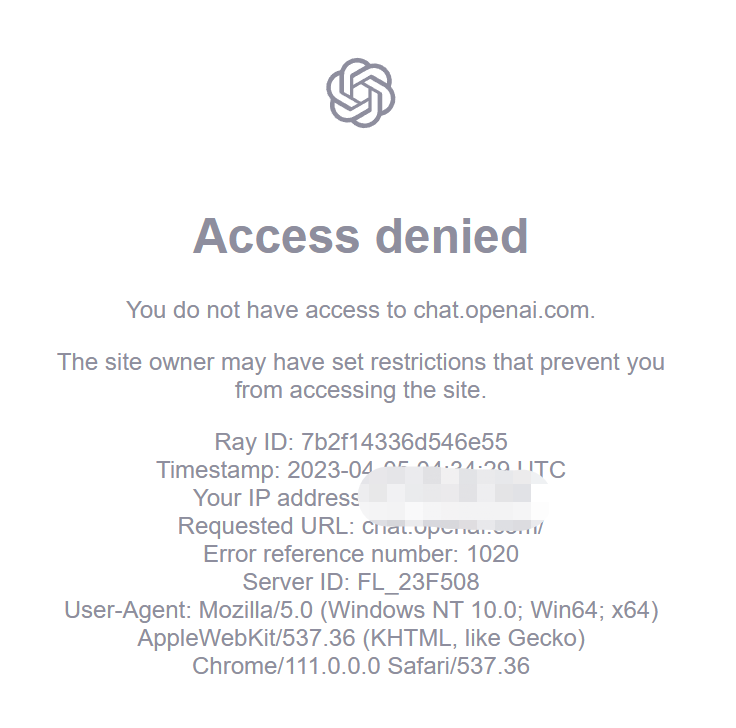

### 现象


这个Access denied错误其实是cloudflare返回的，只要绕开cloudflare的校验就行。

### 方案
使用cloudfare-warp能够绕开这个校验。 https://developers.cloudflare.com/warp-client/

- 准备一台国外的虚拟机
- 安装cloudfare-warp（ubuntu）
```shell
curl https://pkg.cloudflareclient.com/pubkey.gpg | sudo gpg --yes --dearmor --output /usr/share/keyrings/cloudflare-warp-archive-keyring.gpg
echo "deb [arch=amd64 signed-by=/usr/share/keyrings/cloudflare-warp-archive-keyring.gpg] https://pkg.cloudflareclient.com/ $(lsb_release -cs) main" | sudo tee /etc/apt/sources.list.d/cloudflare-client.list
apt update
apt install cloudflare-warp -y
apt install net-tools -y
# 使用socket代理模式
warp-cli --accept-tos set-mode proxy 
# 设置代理端口2080
warp-cli --accept-tos set-proxy-port 2080
# 注册
warp-cli --accept-tos register
# 连接
warp-cli --accept-tos connect

```
- 安装完后默认绑定到`127.0.0.1:2080`，如果需要再别的电脑上访问的话再配置个nginx。
```shell
cat << 'EOF' > /root/cloudfare-wrap-nginx.conf
worker_processes 1;
events {
    use epoll;
    worker_connections  65535;
}
stream {
  server {
    listen 1081;
    proxy_pass 127.0.0.1:2080;
  }
}
EOF
docker run -it --restart always --net host -v /root/cloudfare-wrap-nginx.conf:/etc/nginx/nginx.conf -d --name cloudfare-wrap-nginx nginx
```
现在可以使用`<服务器IP>:1081`这个socks代理来访问`chat.openai.com`了
